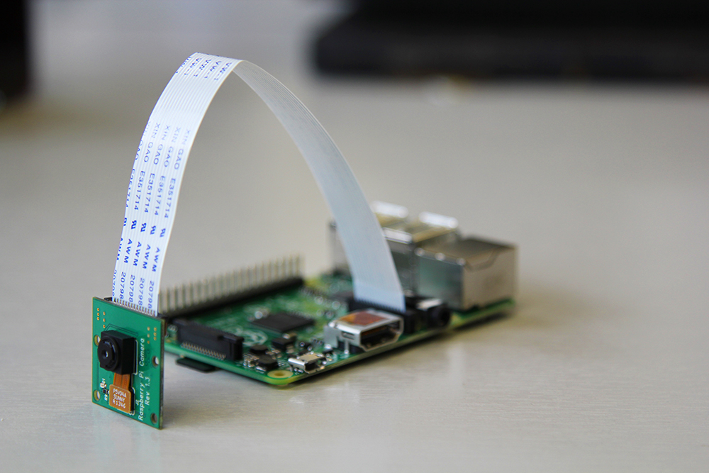

# Push Button Stop Motion

Make your own stop motion animation rig with a push button, using Python Picamera and GPIO.

You can use LEGO to animate a tower being built, figures acting out a scene, or anything else you can think of!

## Connect the camera

Before booting your Pi, you'll need to connect the camera.

Locate the camera port next to the Ethernet port. Lift the tab on the top.

Place the strip in the connector, with the blue side facing the Ethernet port. While holding the strip in place, push down the tab.

Turn the power on to boot the Pi.

    

## Test the camera

Log in and boot to desktop.

Open `LXTerminal` from the desktop or application menu. Enter the following command in ther terminal window:

    ```bash
    raspistill -o image1.jpg
    ```

Adjust the camera to point at yourself or an object. You should see a preview appear on the screen for a few seconds, and then this should change briefly while the image is captured. It doesn't matter if the picture is upside-down; we'll come to that later.

Run the command `ls` to see the files in your home directory; you should see `image1.jpg` listed.

Click the file manager icon in the taskbar and you should see some folders and files. Double-click `image1.jpg` to preview it.

## Take a picture with Python

Return to the `LXTerminal` window, and enter `sudo idle3 &` to start the Python environment.

1. Select `File > New Window` from the menu to open a Python file editor.
1. Carefully enter the following code (case is important!):

    ```python
    import picamera
    from time import sleep

    with picamera.PiCamera() as camera:
        camera.start_preview()
        sleep(5)
        camera.capture('/home/pi/image2.jpg')
        camera.stop_preview()
    ```

1. Select `File > Save` from the menu (or press `Ctrl + S`) and save as `animation.py`.
1. Press `F5` to run the script.
1. Without closing the Python window, return to the file manager window and you'll see the new file `image2.jpg`. Double-click to view the picture. 
1. If the picture is upside-down you can either reposition your camera using a mount, or leave it as it is and tell Python to flip the image. To do this, add the following lines:

    ```python
    camera.vflip = True
    camera.hflip = True
    ```

    inside the `with` loop, so it becomes:

    ```python
    import picamera
    from time import sleep

    with picamera.PiCamera() as camera:
        camera.vflip = True
        camera.hflip = True
        camera.start_preview()
        sleep(5)
        camera.capture('/home/pi/image2.jpg')
        camera.stop_preview()
    ```

1. Run the file again and it will overwrite `image2.jpg` with a new image in the correct orientation. Remember to keep these lines in your code while you alter it in the next few steps.

## Connect a hardware button

Connect the Pi to the button as shown in the diagram below:

    

1. Import the `RPi.GPIO` module at the top of the code, set up GPIO pin 17, and change the `sleep` line to use `GPIO.wait_for_edge` like so:

    ```python
    import picamera
    from time import sleep
    import RPi.GPIO as GPIO

    GPIO.setmode(GPIO.BCM)
    GPIO.setup(17, GPIO.IN, GPIO.PUD_UP)

    with picamera.PiCamera() as camera:
        camera.start_preview()
        GPIO.wait_for_edge(17, GPIO.FALLING)
        camera.capture('/home/pi/image3.jpg')
        camera.stop_preview()
    ```

1. Save and run your script.
1. Once the preview has started, press the button connected to your Pi to capture an image.
1. Return to the file manager window and you should see your `image3.jpg`. Again, double-click to view.

## Take a selfie

If you want to take a photograph of yourself with the camera board, you are going to have to add in a delay, to enable you to get into position. You can do this by modifying your program. 

1. Add a line to your code to tell the program to sleep briefly before capturing an image, as below:

    ```python
    import picamera
    from time import sleep
    import RPi.GPIO as GPIO

    GPIO.setmode(GPIO.BCM)
    GPIO.setup(17, GPIO.IN, GPIO.PUD_UP)

    with picamera.PiCamera() as camera:
        camera.start_preview()
        GPIO.wait_for_edge(17, GPIO.FALLING)
        sleep(5)
        camera.capture('/home/pi/image4.jpg')
        camera.stop_preview()
    ```

1. Save and run your script.
1. Press the button and try to take a selfie. Be sure to keep the camera still! Ideally, it should be mounted in position.
1. Again, feel free to check the image in the file manager. You can run the program again to take another selfie.

## Stop motion animation

Now that you have successfully taken individual photographs with your camera, it's time to try combining a series of still images to make a stop motion animation. 

1. **IMPORTANT** You must create a new folder to store your stills. In the terminal window, enter `mkdir animation`.
1. Modify your code to add a loop to keep taking pictures every time the button is pressed:

    ```python
    import picamera
    import RPi.GPIO as GPIO

    GPIO.setmode(GPIO.BCM)
    GPIO.setup(17, GPIO.IN, GPIO.PUD_UP)

    with picamera.PiCamera() as camera:
        camera.start_preview()
        frame = 1
        while True:
            GPIO.wait_for_edge(17, GPIO.FALLING)
            camera.capture('/home/pi/animation/frame%03d.jpg' % frame)
            frame += 1
        camera.stop_preview()
    ```

1. Now set up your animation subject (e.g. LEGO), ready to start the stop motion animation.
1. **IMPORTANT** This time, do **not** run the program from IDLE as it will be impossible to break out of the loop. Instead, return to the terminal window and enter `sudo python3 animation.py`.
1. Press the button to capture the first frame, then rearrange the animation subject and press the button again to capture each subsequent frame.
1. Once all the frames have been captured, press `Ctrl + C` which will terminate the program.
1. Open the `animation` folder in the file manager to see your stills collection.

## Render the video

1. Now return to the terminal window.
1. Run the video rendering command:

    ```bash
    avconv -r 10 -qscale 2 -i animation/%03d.jpg animation.mp4
    ```

You can adjust the frame rate by editing the rendering command. Try changing `-r 10` (10 frames per second) to another number.

1. This will take about 2 minutes per frame. Once complete, you can play the video with the following command:

    ```bash
    omxplayer animation.mp4
    ```

You can also change the filename of the rendered video to stop it from overwriting your first attempt. To do this, change `animation.mp4` to something else.

## What next?

- Why not share your video? Try uploading it to YouTube!
- Now you know how to wire up a button to take a picture with the camera module, what else could you use this for?
- Could you do something similar for a time-lapse video?
- What could you use instead of a button? A motion sensor?
- Instead of making a video, what else could you do with photos taken with the camera module? You could post them to Twitter, or another social media site. 
